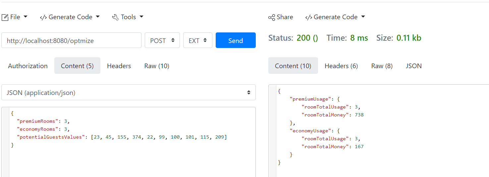

# Romm Occupancy Manager

This project was developed to fulfil a requirement for a Software Engineer position.
The main goal is to produce a high quality code and deliver an API that provides an interface for Hotels to enter the numbers of Premium and Economy rooms available for the night and how many rooms would be filled and how much money they'll make at the end of the day.

## Getting started
This project was developed using [Open JDK 14](https://jdk.java.net/java-se-ri/14), [Apache Maven](https://maven.apache.org/) and [Spring Boot](https://spring.io/projects/spring-boot).

You can use any IDE to view and edit this project.
<br><br>

## Running and testing

1. Test if everything is OK
```
mvn clean verify
```

2. Run
```
./mvnw spring-boot:run
```

3. Docker support
You can build and run using the Dockerfile provided in the project
First run the maven package command to build and package de API
```
mvn clean package
```

Now just run the docker commands to build and run the newly created image
```
docker build -t <image_tag> .
docker run -d -p 8080:8080 <image_tag>
```
<br>

## Executing the API
You can use any tool to test the REST API, such as [REQBIN](https://reqbin.com/) or [Postman](https://www.postman.com/)

An example using REQBIN:


There is also the possibility to test via curl
```
curl -X POST -H 'Content-Type: application/json' \
-d '{ "premiumRooms": 3, "economyRooms": 3, "potentialGuestsValues": [23, 45, 155, 374, 22, 99, 100, 101, 115, 209] }' \
http://localhost:8080/optimize
```
